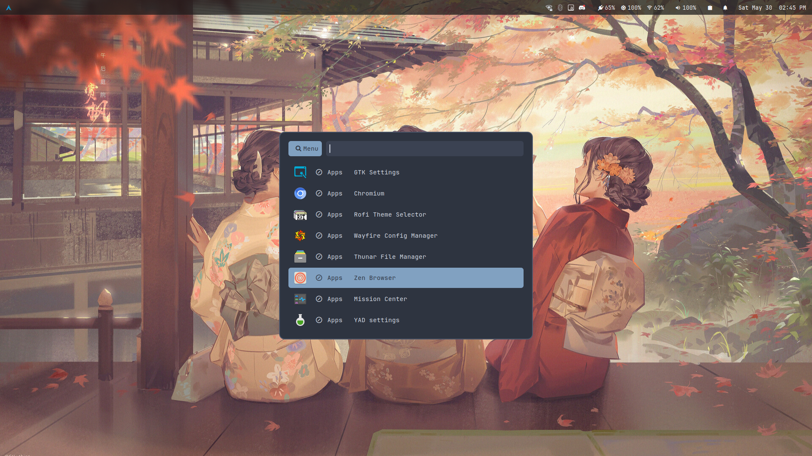

# 󰅍 rofi-scripts

A modular, minimalist layout for RAG-driven workflows, terminal multiplexing, and rapid context switches on Arch Linux. Built around a unified theme architecture.

## 🛠️ Components

### 📦 `config.rasi` & `style.rasi`
* Configures layout modes: `drun`, `run`, and `window`.
* Sets up pointer-interactive behaviors (`hover-select: true`).
* Pipelines interface parameters down to custom modular states via `@theme "style"`.

### 📋 `clipboard`
* Implements sequential extraction workflows.
* Pipes runtime targets down to native copy mechanisms:

### 📂 `files`
* Async custom discovery mode leveraging fast tree traversal.
* Passes raw strings into an embedded `AWK` token translation state machine for $O(1)$ file-type dictionary mapping.
* Formats strings into clean terminal patterns (`filename | path`) and returns explicit operational pointers:
* Binds action sequences directly to your custom micro-utility runner (`xl-open`) via `ROFI_INFO` telemetry.
---

*<< Tailored for `(idleshade  Quanta)` >>*
